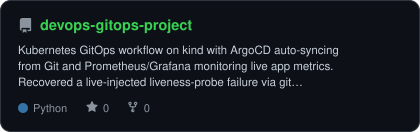
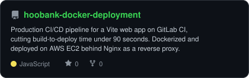
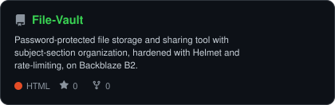

<div align="center">


<a href="https://linkedin.com/in/preetam-b-kambar"></a>
<a href="mailto:pritamkambar4@gmail.com"></a>
<a href="https://preetamkambar.cloud"></a>
<a href="https://github.com/Preet0m"></a>


</div>

<br>

## `~/` kubectl get preetam

```console
$ kubectl get pod preetam -o wide
```

Hi, I'm **Preetam Basavaraj Kambar** — a Cloud & DevOps Engineer building and breaking Kubernetes clusters, mostly on an 8GB laptop that has no business running as much as it does.

- Currently building **[Kubernetes GitOps Pipeline](https://github.com/Preet0m/devops-gitops-project)** — ArgoCD, Kustomize, Prometheus & Grafana on a self-managed `kind` cluster
- Portfolio: **[preetamkambar.cloud](https://preetamkambar.cloud)**
- Learning **multi-tenant Kubernetes patterns & policy-as-code with OPA**
- Fun fact: my entire dev environment — kind, ArgoCD, Prometheus, Grafana, GitHub Actions — runs on 8GB of RAM and mild denial

<br>

## `~/` toolbox


<br>

## `~/` skill radar

<table>
<tr>
<td width="50%" align="center">
<picture>
<source media="(prefers-color-scheme: dark)" srcset="assets/radar-dark.svg">
<source media="(prefers-color-scheme: light)" srcset="assets/radar-light.svg">

</picture>
<br><sub>self-rated</sub>
</td>
<td width="50%" align="center">
<picture>
<source media="(prefers-color-scheme: dark)" srcset="assets/radar-langs-dark.svg">
<source media="(prefers-color-scheme: light)" srcset="assets/radar-langs-light.svg">

</picture>
<br><sub>actual language bytes, from the GitHub API</sub>
</td>
</tr>
</table>

<br>

## `~/` stats

<picture>
<source media="(prefers-color-scheme: dark)" srcset="assets/stats-dark.svg">
<source media="(prefers-color-scheme: light)" srcset="assets/stats-light.svg">

</picture>

<br><br>

## `~/` projects

<table>
<tr>
<td width="50%">
<a href="https://github.com/Preet0m/devops-gitops-project">
<picture>
<source media="(prefers-color-scheme: dark)" srcset="assets/card-devops-gitops-project-dark.svg">
<source media="(prefers-color-scheme: light)" srcset="assets/card-devops-gitops-project-light.svg">

</picture>
</a>
</td>
<td width="50%">
<a href="https://github.com/Preet0m/hoobank-docker-deployment">
<picture>
<source media="(prefers-color-scheme: dark)" srcset="assets/card-hoobank-docker-deployment-dark.svg">
<source media="(prefers-color-scheme: light)" srcset="assets/card-hoobank-docker-deployment-light.svg">

</picture>
</a>
</td>
</tr>
<tr>
<td colspan="2" align="center">
<a href="https://github.com/Preet0m/File-Vault">
<picture>
<source media="(prefers-color-scheme: dark)" srcset="assets/card-File-Vault-dark.svg">
<source media="(prefers-color-scheme: light)" srcset="assets/card-File-Vault-light.svg">

</picture>
</a>
</td>
</tr>
</table>

<sub>

| Project | Stack | Link |
|---|---|---|
| K8s GitOps Pipeline | Kubernetes · ArgoCD · Kustomize · Prometheus · Grafana | [repo](https://github.com/Preet0m/devops-gitops-project) |
| Automated Web App Deployment Pipeline | AWS EC2 · Docker · GitLab CI/CD · Nginx | [repo](https://github.com/Preet0m/hoobank-docker-deployment) |
| File Vault | Node.js · Express · Backblaze B2 | [filevault.store](https://filevault.store) |

</sub>

<br>

<div align="center">
<sub>kubectl apply -f resume.yaml · <a href="https://preetamkambar.cloud">preetamkambar.cloud</a></sub>
</div>
